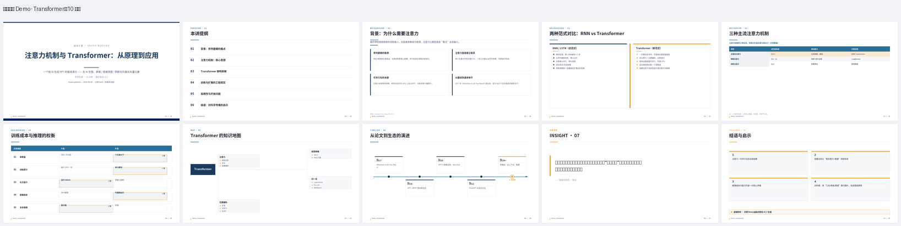
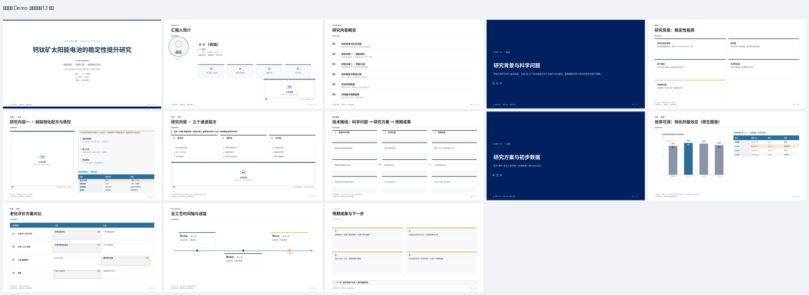

<div align="center">

# 🎓 pptagent · 学术 PPT 融合管线

**输入一段文字（学术科普 / 研究计划 / 文献解读 / 综述），输出原生可编辑 PPTX。**

无 AI 生图 · 表格精美 · 思维导图 · 内容诚实 · 风格可积累 · LLM 大脑可插拔

</div>

---

## ✨ 它是什么

一套**端到端的学术 PPT 生成管线**：把一段文字提炼成结构化内容 → 逐页规划 →
确定性渲染成 SVG → 转换成 **PowerPoint 原生可编辑 .pptx**（真实形状 / 表格 /
图表 / 阴影，不是图片拼贴）。

核心理念：

| 理念 | 做法 |
|---|---|
| **无 AI 生图** | 视觉表达全靠色块 / 几何 / 巨字 / 图标符号 / 排版留白，绝不生成图片 |
| **原生可编辑** | 输出的是真实 PPTX 元素——表格、柱状图、形状、阴影都可直接编辑 |
| **内容诚实** | 只呈现有来源的内容，编造的引用 / 数字 / 头衔一律拦截（见 [诚实协议](docs/HONESTY_PROTOCOL.md)） |
| **风格可积累** | 每打磨认可一版 deck，`add` 成风格种子；下次规划自动检索最像的种子做 few-shot（零训练、可回滚） |
| **质量门把关** | 每页跑程序化 QA（溢出 / 字号 / 配色纪律 / 视觉像素校验），不合格拒绝交付 |
| **LLM 大脑可插拔** | 渲染段纯确定性；「材料 → deck 计划」这一步抽象成 OpenAI 兼容客户端，换 key / 换模型即可 |

## 📸 效果

**学术科普 Demo · Transformer（10 页，来自 `examples/`）**



**研究计划 Demo · 虚构示例（13 页，来自 `styles/research-plan-13p.json`）**



> 以上截图由管线自身的 `render_preview.py` 直接渲染 SVG 得到，与最终 PPTX 同源。

## 🚀 快速开始

```bash
# 0. 准备转换引擎（见 docs/ENGINE.md）
git clone https://github.com/hugohe3/ppt-master.git ../ppt-master

# 1. 一键生成 PPTX（用示例 deck）
python3 -m pptagent.run examples/demo_deck_plan.json \
    --out exports/demo --engine ../ppt-master

# 2. 打开浏览器预览（SVG 渲染，与 PPTX 同源）
open exports/demo/preview/index.html

# 3. 打磨认可后存成风格种子（供下次规划参考）
python3 -m pptagent.styles add <名称> work/<deck>/deck_plan.json \
    --genre <学术科普|研究计划|文献解读|综述> --keywords "主题1,主题2"
python3 -m pptagent.styles approve <名称>
```

**带 LLM 大脑的一键工作流**（用户材料 → 合格 PPTX）：

```bash
python3 -m pptagent.autopilot examples/demo/材料/ \
    --template 组会模板.pptx --out exports/autopilot \
    --api-key sk-你的key --base-url https://api.deepseek.com/v1 --model deepseek-chat \
    --reviews 2     # 可选：LLM 三视角评审循环
```

- `--api-key / --base-url / --model` 可换任意 OpenAI 兼容端点（DeepSeek / OpenAI / vLLM / 本地服务）
- 也支持环境变量 `FUSED_LLM_BASE_URL / FUSED_LLM_API_KEY / FUSED_LLM_MODEL`
- 不指定 `--style` 时，autopilot 自动从 `styles/` 风格库检索最匹配的种子作 few-shot 参考

## 🔧 管线

```
输入文字（学术科普 / 研究计划 / 文献 / 综述）
   │
   ▼ Stage 1 · 提炼（LLM，出 JSON）
ContentGraph：标题 / 章节 / 要点 / 表格 / 概念 / 结论
   │
   ▼ Stage 2 · 计划（LLM + 学术分页预算）
DeckPlan：逐页布局（cover / section / content / table / compare / mindmap / timeline / route / …）
   │
   ▼ Stage 3 · 生成（确定性代码，设计 token 驱动）
每页 SVG（1280×720，阴影 / 卡片 / 原生表格 / 原生图表 / 几何示意图）
   │
   ▼ Stage 4 · 转换（ppt-master 引擎）
原生可编辑 .pptx（真实形状 / 表格 / 阴影 / 误差棒）
   │
   ▼ Stage 5 · 质量门 + 程序化 QA
不合格 → 回 Stage 2 / Stage 3 修正
   │
   ▼
exports/<deck>.pptx + 预览 + QA 报告
```

## 🗂 目录结构

```
pptagent/
  schema.py           # ContentGraph / DeckPlan 数据契约
  svggen.py           # 布局 → SVG 页面生成器（12+ 种布局）
  plan.py             # 学术分页预算 + 结构校验
  styles.py           # ★ 风格库：种子存取 / 检索 / CLI
  run.py              # 编排：生成 → 质量门 → 转换
  honesty.py          # 内容诚实检查器（--honesty 闸门）
  svg_audit.py        # 程序化 SVG 审计（溢出 / 字号 / 配色纪律）
  pixel_qa.py         # 渲染像素级 QA（主题感知掩码）
  llm.py              # ★ 可插拔 LLM 大脑（OpenAI 兼容）
  autopilot.py        # ★ 一键：材料 → 合格 PPTX
  apply_template.py   # 套用用户模板主题（字体 / 主题色）
  charts.py           # 联网拉取开放版权参考图（失败回落占位）
  design/tokens.py    # 设计系统（配色 / 字体 / 阴影 / 布局）
  render_preview.py   # SVG → PNG 预览 + index.html
examples/             # 可直接跑的示例（Transformer 科普 10 页）
styles/               # ★ 风格库（打磨认可的种子）
SKILL.md              # 给 Agent（Claude Code / 其他 LLM）看的完整工作流
docs/                 # 架构 / 诚实协议 / 评审循环 / 产品化蓝图 / 参考规范
```

## 🎨 布局与设计纪律

支持 12+ 种学术布局：`cover` `overview` `section` `content` `two_col` `compare`
`mindmap` `table` `chart_table` `fig_table_text` `fig_points` `research` `route`
`timeline` `quote` `takeaway` `profile`，以及 `diagram`（六边形 / 工艺流程图等几何示意）。

设计纪律（"好看"的保障，全部编码在 [tokens.py](pptagent/design/tokens.py)）：

单一锚点色 · 灰阶三级层级 · 发丝线 · 卡片四类互斥 · 阴影克制 ·
**表格第一**（数据必进表）· 思维导图几何化 · **无 AI 生图**。

## 🧭 风格库（联网 few-shot，替代权重微调）

不训练模型。每打磨认可一版 deck，`styles add` 存成种子；下次规划先 `pick` 最相似
种子作参考——风格稳定、可回滚、**越用越像你的审美**。离线 LoRA 微调留作备选，
见 [docs/LORA_PLAN.md](docs/LORA_PLAN.md)。

## 🛡 内容诚实（Honesty Protocol）

管线有一条铁律：**没有来源支撑的内容 = 不存在**。任何一次生成 / 修改前，
先对 `sources_manifest.json`（用户实际提供了什么）逐条核对 deck 计划——
编造引用 `[N]`、无出处的数字 / 头衔 / 单位，一律拦截并要求修正（限 3 次自动回炉）。

详见 [docs/HONESTY_PROTOCOL.md](docs/HONESTY_PROTOCOL.md) 与 [docs/REVIEW_LOOP.md](docs/REVIEW_LOOP.md)。

## ⚠️ 诚实限制

- 中文字长折行是估算的，超长词 / URL 可能出框。
- 阴影 / 圆角在 PPTX 中保留为原生效果，不同 Office 版本渲染略有差异。
- 无 LibreOffice 时无法直接把 PPTX 渲染成图做像素级"截图像反思"；目前用 SVG 渲染预览代替。
- 复杂图表（折线 / 散点）尚未接入原生图表接口（柱状图 + 误差棒已就绪）。
- 示例 deck 与研究计划风格种子均为虚构演示内容，不构成任何真实实验数据。

## 📦 依赖

- Python 3.10+，`python-pptx`、`lxml`
- 转换引擎 [ppt-master](https://github.com/hugohe3/ppt-master)（SVG → PPTX），见 [docs/ENGINE.md](docs/ENGINE.md)
- 预览渲染（可选）：`cairosvg` + 系统中文字体

## 🙏 致谢

本项目是**多仓库融合**的产物——站在巨人肩膀上，按需吸收、各自取舍（详见 [docs/ARCHITECTURE.md](docs/ARCHITECTURE.md)）：

| 来源 | 吸收什么 |
|---|---|
| [ppt-master](https://github.com/hugohe3/ppt-master) | SVG → 可编辑 PPTX 转换引擎（原生表格 / 图表 / 阴影 / 误差棒）、质量门、Claude Code 工作流模式 |
| [paper-ppt-agent](https://github.com/CRui5in/paper-ppt-agent) | 学术分页预算、静态 SVG 质量审查、无 AI 生图的视觉表达 |
| [PPTAgent](https://github.com/icip-cas/PPTAgent) | 反思式生成理念、学术模板归纳 |
| [guizang-ppt-skill](https://github.com/op7418/guizang-ppt-skill) | "约束 > 创造"设计纪律：单一锚点色、发丝线、卡片互斥、表格 |
| **kimiPPT 学术规范** | 学术排版参考规范（见 [docs/reference-kimi/](docs/reference-kimi/)，仅作设计参考，不进入内容） |

## 📄 License

MIT，见 [LICENSE](LICENSE)。
